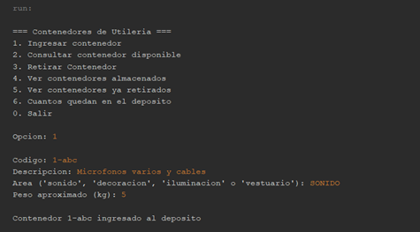
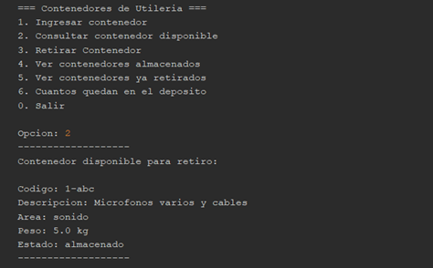
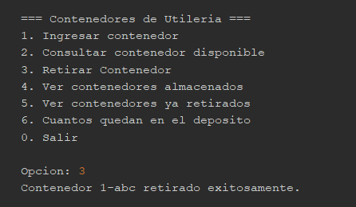
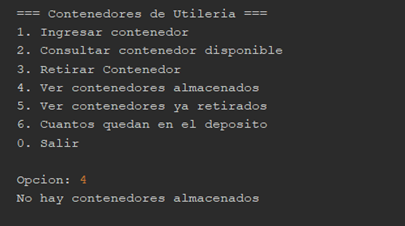
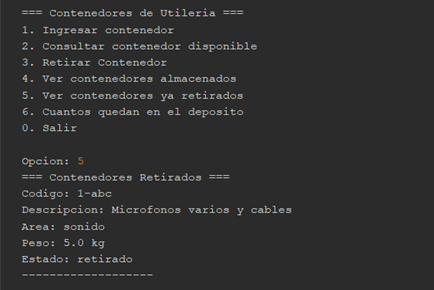
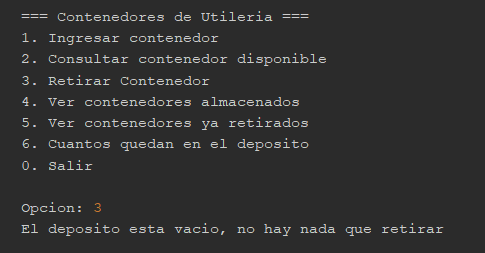
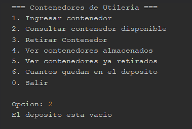

# Sistema de Gestión de Depósito de Utilería - Estructura de Datos

Este proyecto es una aplicación desarrollada en **Java** para la gestión logística de contenedores de utilería en un festival cultural, empleando estructuras de datos lineales para optimizar el control de acceso y almacenamiento.

### 📂 Ubicación del Código
El código fuente principal con toda la lógica del programa se encuentra en la siguiente ruta:
`src > estructura31 > Estructura31.java`

### 🛠️ Detalles de la Implementación
* **Estructura de Datos:** Implementación de una `Stack` (Pila) para gestionar el depósito con acceso LIFO (Last In, First Out), respetando la restricción física de una única puerta.
* **Historial de Despachos:** Uso de una `LinkedList` para registrar de forma ordenada y persistente los contenedores retirados del depósito.
* **Modelado de Datos:** Creación de una clase interna `Contenedor` para encapsular los atributos (código, descripción, área, peso y estado), mejorando la modularidad del sistema.
* **Validación de Dominio:** Implementación de filtros para asegurar que solo se ingresen áreas autorizadas.
* **Gestión de Errores:** Control de flujo preventivo mediante `isEmpty()` para evitar excepciones de tiempo de ejecución al intentar extraer datos de un depósito vacío.
* **Interfaz de Consola:** Menú interactivo continuo diseñado para una navegación eficiente y una visualización clara de los estados del inventario y del historial.

> **Nota para el profesor:** He subido el proyecto completo a este repositorio de GitHub para garantizar la visualización del código con total claridad y complementar la documentación técnica entregada.

---

## 💻 Capturas de la Implementación (Consola)

A continuación se muestran las pruebas de ejecución del sistema, demostrando las operaciones de ingreso, consulta, retiro y manejo de errores:

### Captura 1: Ingreso de contenedores y validación de áreas

### Captura 2: Consulta del tope de la pila

### Captura 3: Retiro de contenedor (Acceso LIFO)

### Captura 4: Visualización de historiales

### Captura 5: Validación de depósito vacío

---
**Desarrollado por:** Víctor Manuel Cordoba Larez
**Carrera:** Ingeniería Informática
**Materia:** Estructura de Datos
**Institución:** Corporación Universitaria Lasallista
